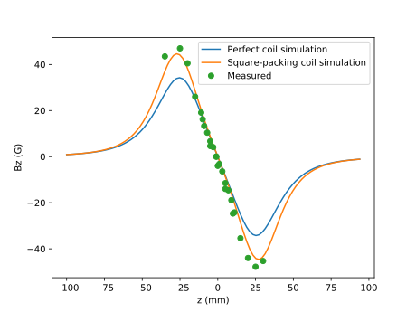
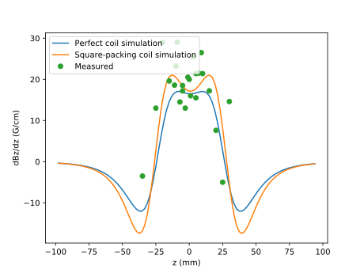

.. FI226: Magnetic trap documentation master file, created by
   sphinx-quickstart on Sun Jun 23 16:58:22 2019.
   You can adapt this file completely to your liking, but it should at least
   contain the root `toctree` directive.

FI226: Magnetic trap
================================================

Simulation of the magnetic field generated by a anti-helmholtz coil done as a homework of FI226 (IFGW-Unicamp).

.. toctree::
   :maxdepth: 2
   :caption: Python scripts/modules:

   coil_utils
   coilSimulation_exact
   coilSimulation_real

coil_utils.py module is intended to calculates the magnetic field of
coils. The parameters of the function are illustrated in fig. 1 and 2 for an
arbitrary current loop and for anti-helmholtz coil, respectively.

coilSimulation_exact.py and coilSimulation_real.py simulates the
helmholtz coil given some parameters.

Fig 1.

Fig 2.

Figures 3 and 4 shows the simulated results of a anti-helmholtz coil together
with measured data using a gaussimeter. The coils had 150 turns and R=2.5 cm,
D=2.45 cm, I=1 A. The default values of coilSimulation_exact.py and
coilSimulation_real.py reproduce these results.

Fig 3.

Fig 4.

.. Indices and tables
.. ==================

.. * :ref:`genindex`
.. * :ref:`modindex`
.. * :ref:`search`
